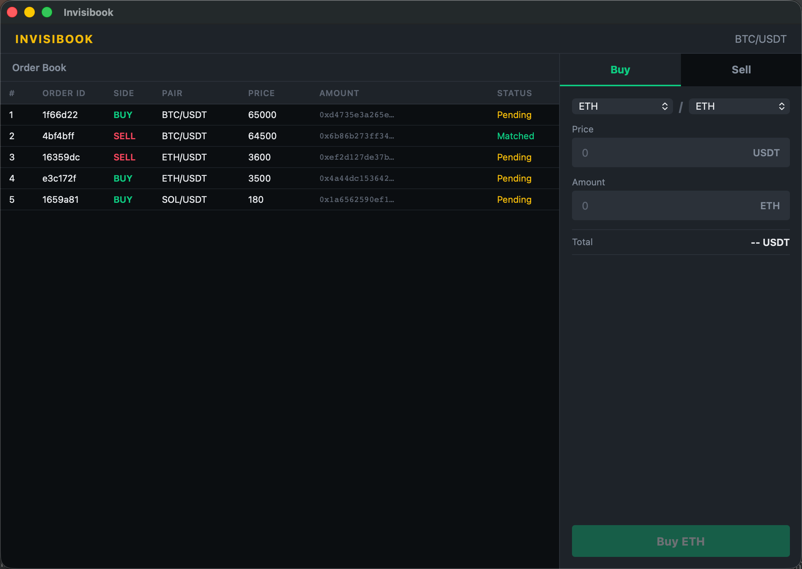

# invisibook

A privacy-preserving order book built on pure cryptography — no TEE, no centralized infrastructure. Invisibook tackles the three hard problems of **privacy**, **censorship resistance**, and **price discovery** simultaneously, solving what traditional DEXs, CEXs, and dark pools cannot. Trade amounts are encrypted end-to-end: only the order creator can see the plain-text amount; everyone else sees the cipher.



## Prerequisites

- **Rust 1.74+** – [install](https://www.rust-lang.org/tools/install)

## Build & Run

```bash
cd app
cargo run --release
```

This compiles and launches the desktop app natively.

## Usage

Use the trade form on the right panel to place orders:

- Select **Buy** or **Sell**
- Choose a token pair from the dropdowns
- Enter a **Price** and **Amount** (positive integers)
- Click the submit button

### Privacy

- **Your own orders:** amount is displayed in plain text.
- **Other orders:** amount is shown as encrypted cipher text.

## License

See [LICENSE](LICENSE).
