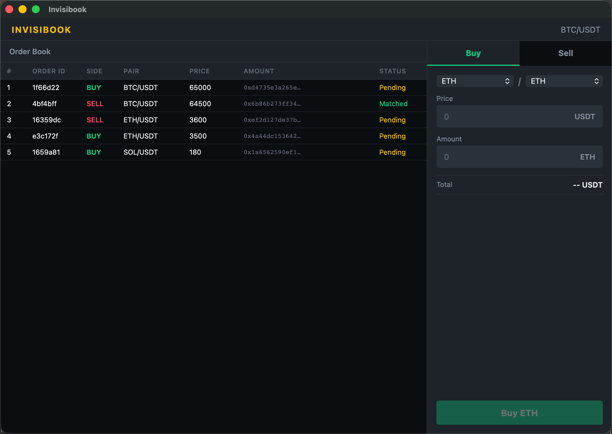

# invisibook

A privacy-preserving order book built on pure cryptography — no TEE, no centralized infrastructure. Invisibook tackles the three hard problems of **privacy**, **censorship resistance**, and **price discovery** simultaneously, solving what traditional DEXs, CEXs, and dark pools cannot. Trade amounts are encrypted end-to-end: only the order creator can see the plain-text amount; everyone else sees the cipher.



## Prerequisites

- **Go 1.21+** – [install](https://go.dev/dl/)
- **Rust nightly** – [install](https://www.rust-lang.org/tools/install), then `rustup install nightly`
- **GCC / C compiler** – required by CGo (SQLite driver)
- **Node.js 18+** – [install](https://nodejs.org/) (required for circom witness generation)
- **circom 2.2+** – `cargo install --git https://github.com/iden3/circom.git`
- **snarkjs** – `npm install -g snarkjs`
- **rapidsnark** (optional, for fast proving) – build from [iden3/rapidsnark](https://github.com/iden3/rapidsnark)

## Build & Run

### Chain

The default build includes the cozk2p PLONK verifier (the collaborative
settlement path); it needs Rust for the verifier staticlib:

```bash
make build-chain     # builds the cozk2p staticlib + go build -tags cozk2p
cd chain && ./invisibook
```

`make build-chain-lite` produces a pure-Go binary WITHOUT the verifier —
dev only. It refuses to boot on any config that sets
`settle_cozk2p_vk_path`, so it cannot silently run as a production node.

The chain node listens on:
- **HTTP** `localhost:7999` – reading & writing API
- **WebSocket** `localhost:8999`
- **P2P** `localhost:8887`

Configuration files are in `chain/cfg/`:
- `chain.toml` – yu framework config (ports, consensus, chain_id)
- `core.toml` – tripod config (DB paths, verifying keys, genesis pool notes)

### Docker

Build the image and start the container:

```bash
docker-compose build
docker-compose up -d
```


To stop:

```bash
docker-compose down
```

### Desktop

```bash
cd app/desktop
cargo run --release
```

### Mobile (iOS / Android)

Mobile builds use [Dioxus CLI](https://dioxuslabs.com/learn/0.6/CLI/installation). Install it first:

```bash
cargo install dioxus-cli
```

**iOS** (requires macOS + Xcode):

```bash
cd app/mobile
dx serve --platform ios
```

**Android** (requires Android SDK + NDK):

```bash
cd app/mobile
dx serve --platform android
```

## Usage

Use the trade form on the right panel to place orders:

- Select **Buy** or **Sell**
- Choose a token pair from the dropdowns
- Enter a **Price** and **Amount** (positive integers)
- Click the submit button

### Privacy

- **Your own orders:** amount is displayed in plain text.
- **Other orders:** amount is shown as encrypted cipher text.

## Collaborative ZK Settlement (co-zk)

Matched orders settle in two phases. First the two traders **jointly
prove the comparison of their hidden quantities** ([cozk2p](cozk2p/):
malicious-secure SPDZ + collaborative TurboPlonk, no helper node) and
anchor it on chain — nothing is revealed before that anchor lands. Then
each side proves its own settlement circuit, the signed legs are
exchanged, and one **atomic `SettlePair`** writing applies both sides
together: the fully filled order closes, the surviving order is relisted
in place with fresh residual commitments (keeping its time priority),
and both payout notes mint in one step. See
[docs/cozk2p_design.md](docs/cozk2p_design.md) for the protocol and
threat model, and [docs/cozk_experiments.md](docs/cozk_experiments.md)
for measurements.

```bash
# unit + satisfiability + 2-party e2e (mock network)
cd cozk2p && cargo test

# benchmark: single-prover vs full 2-party session
cargo run --release --bin bench_settle2p -- --runs 5

# real collaborative proof settled on a running chain
make test-e2e-cozk2p
```

## Documentation

The documentation index is [docs/README.md](docs/README.md). It lists
every design document with its status, and
[docs/paper_deviations.md](docs/paper_deviations.md) records each place
the implementation differs from the protocol paper
([papers/invisibook.pdf](papers/invisibook.pdf)).

## License

See [LICENSE](LICENSE).
